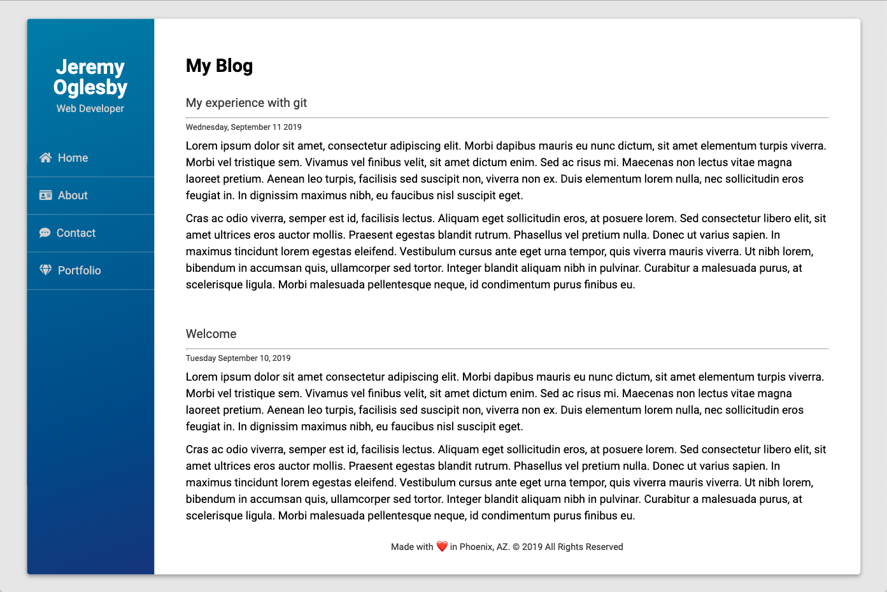

# Git Blog App

This is not a live blog, but rather a practice project undertaken for the purpose of learning more about how git and GitHub can be used as a team tool.

In the process of building this blog, I got experience with the following processes:

* Creating, assigning, and fulfilling GitHub issues
* Creating, pusing, and pulling branches
* Creating pull requests
* Performing code reviews on pull requests
* Resolving merge conflicts
* Fetching and Rebasing the local git HEAD
* Stashing changes and popping the stash into another branch

I am confident that this practice has better prepared me for working with a team, using features of both git and GitHub in a collaborative manner.

Thanks for reading -
**Jeremy Oglesby**
